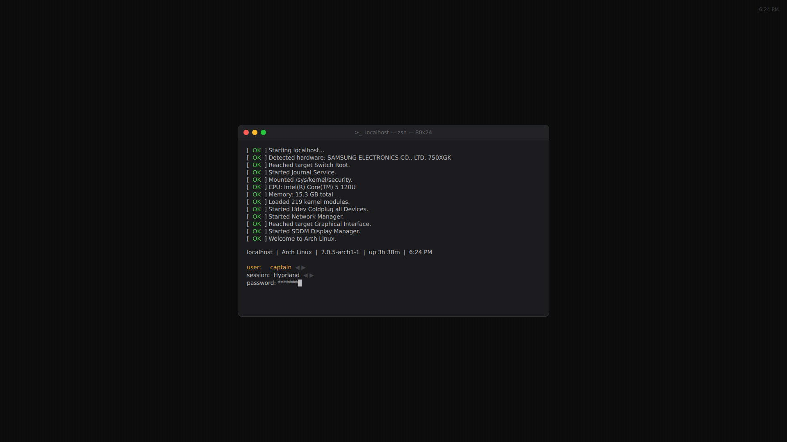
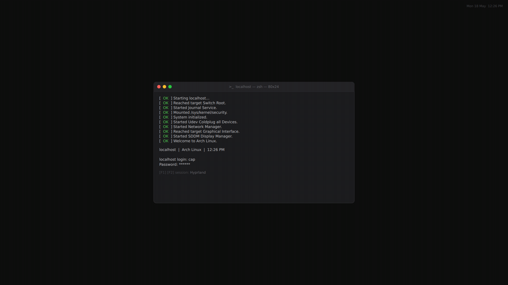
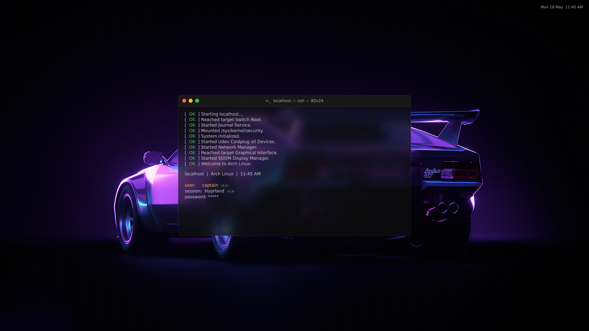
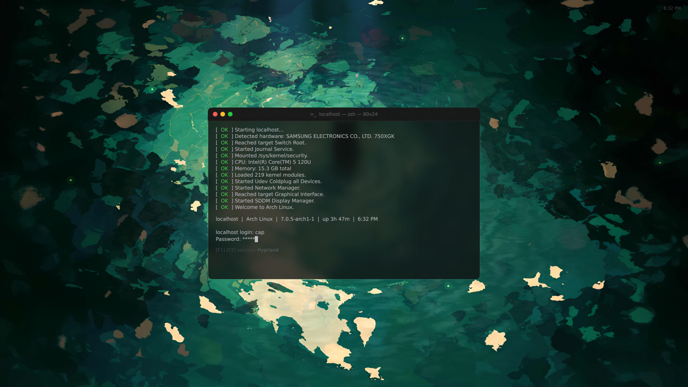
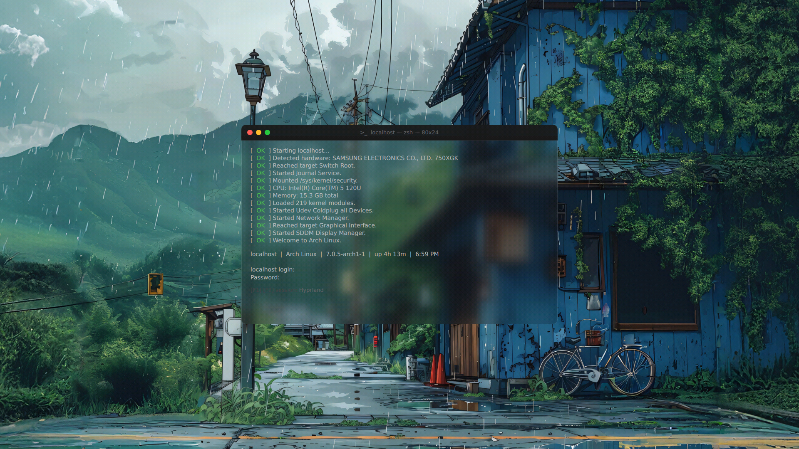

# Echo SDDM

A macOS Terminal-inspired SDDM login theme. Dark monospace aesthetic, frosted glass, boot animation with real system data, and two login modes.

<div align="center">
  
  
</div>
<div align="center">
  
  
  
</div>

## Features

- **macOS Terminal UI:** Dark window with traffic light buttons (shutdown, reboot, suspend), title bar, and rounded corners.
- **Real Boot Animation:** Fake systemd log lines generated from your actual hardware — CPU, RAM, kernel, modules, distro.
- **Two Background Modes:** Pure black or frosted glass (wallpaper + blur).
- **Two Login Modes:** Arrow-key user/session picker or TTY-style manual login.
- **Real System Info:** Hostname, distro, kernel version, uptime — all read live from `/proc` and `/etc/os-release`.
- **24h/12h Clock:** Configurable via `theme.conf`.

---

## Prerequisites

Qt6 with qt6-5compat (for FastBlur and OpacityMask):

```bash
# Arch
sudo pacman -S qt6-declarative qt6-5compat

# Fedora
sudo dnf install qt6-qtdeclarative qt6-qt5compat

# Debian 13/Testing
sudo apt install libqt6quick6 libqt6qml6 qt6-5compat-dev
```

JetBrains Mono font must be installed (or set a different font in `theme.conf`).

---

## Installation

### Method A: Install Script (Recommended)

```bash
git clone https://github.com/xCaptaiN09/echo-sddm.git
cd echo-sddm
sudo ./install.sh
```

The script backs up your existing config, installs the theme, and restores your settings.

### Method B: Arch Linux (AUR)

```bash
yay -S echo-sddm-git
```

### Method C: Manual

1. Copy to SDDM themes directory:
   ```bash
   sudo cp -r echo-sddm /usr/share/sddm/themes/echo
   ```
2. Set the theme:
   ```ini
   # /etc/sddm.conf.d/theme.conf
   [Theme]
   Current=echo
   ```

---

## Testing

Preview without logging out:

```bash
QML_XHR_ALLOW_FILE_READ=1 sddm-greeter-qt6 --test-mode --theme /usr/share/sddm/themes/echo
```

> `QML_XHR_ALLOW_FILE_READ=1` is only needed in test mode. Real SDDM reads system files automatically.

### Important: Qt6 Greeter

This theme requires the Qt6 greeter. If SDDM fails to load the theme, make sure it uses the Qt6 greeter:

```bash
sudo ln -sf /usr/bin/sddm-greeter-qt6 /usr/bin/sddm-greeter
```

---

## Configuration

Edit `theme.conf`:

| Option | Default | Description |
|--------|---------|-------------|
| `type` | `pure` | `pure` (black) or `frosted` (wallpaper + blur) |
| `login_mode` | `select` | `select` (arrow keys) or `tty` (type username) |
| `background` | `assets/backgrounds/background.png` | Wallpaper path for frosted mode |
| `font` | `JetBrains Mono` | Any installed monospace font |
| `font_size` | `14` | Font size in pixels |
| `boot_interval` | `72` | Milliseconds per boot log line |
| `use_24h` | `true` | `true` for 24h, `false` for 12h with AM/PM |
| `background_opacity` | `0.78` | Frosted glass opacity (0.0–1.0) |
| `blur_radius` | `54` | Blur strength for frosted mode (0–100) |

### Frosted Glass

Set `type=frosted` and point `background` to a wallpaper:

```ini
type=frosted
background=assets/backgrounds/background.png
```

### TTY Mode

Set `login_mode=tty` for a real Linux TTY-style login:

```ini
login_mode=tty
```

Type your username, press Enter, type password, press Enter to login. F1/F2 cycles sessions.

---

## Keyboard Controls

### Select Mode
| Key | Action |
|-----|--------|
| Left / Right | Cycle users or sessions |
| Tab / Down | Next row |
| Up / Shift+Tab | Previous row |
| Enter | Submit login |

### TTY Mode
| Key | Action |
|-----|--------|
| F1 / F2 | Cycle sessions |
| Enter | Submit field / login |
| Tab | Switch between username and password |

---

## Traffic Lights

| Button | Action |
|--------|--------|
| Red | Shutdown |
| Yellow | Reboot |
| Green | Suspend |

---

## Credits

- **Author:** [xCaptaiN09](https://github.com/xCaptaiN09)
- **Design:** Inspired by macOS Terminal.app
- **Font:** JetBrains Mono (system font, not bundled)

---

*Made with 💙 for the Linux community*
